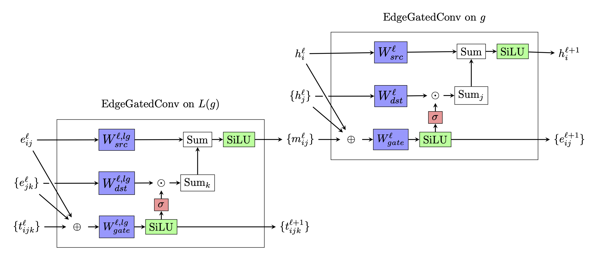

[](https://codecov.io/gh/usnistgov/alignn)
[](https://paperswithcode.com/sota/formation-energy-on-materials-project?p=atomistic-line-graph-neural-network-for)
[](https://paperswithcode.com/sota/band-gap-on-materials-project?p=atomistic-line-graph-neural-network-for)
[](https://paperswithcode.com/sota/formation-energy-on-qm9?p=atomistic-line-graph-neural-network-for)
[](https://paperswithcode.com/sota/formation-energy-on-jarvis-dft-formation?p=atomistic-line-graph-neural-network-for)
[](https://paperswithcode.com/sota/band-gap-on-jarvis-dft?p=atomistic-line-graph-neural-network-for)
# ALIGNN
The Atomistic Line Graph Neural Network (https://arxiv.org/abs/2106.01829)  introduces a new graph convolution layer that explicitly models both two and three body interactions in atomistic systems (To be published in NPJ Computational Materials Science).

This is achieved by composing two edge-gated graph convolution layers, the first applied to the atomistic line graph *L(g)* (representing triplet interactions) and the second applied to the atomistic bond graph *g* (representing pair interactions).


The atomistic graph *g* consists of a node for each atom *i* (with atom/node representations *h<sub>i</sub>*), and one edge for each atom pair within a cutoff radius (with bond/pair representations *e<sub>ij</sub>*).

The atomistic line graph *L(g)* represents relationships between atom triplets: it has nodes corresponding to bonds (sharing representations *e<sub>ij</sub>* with those in *g*) and edges corresponding to bond angles (with angle/triplet representations *t<sub>ijk</sub>*).

The line graph convolution updates the triplet representations and the pair representations; the direct graph convolution further updates the pair representations and the atom representations.




Installation
-------------------------
First create a conda environment:
Install miniconda environment from https://conda.io/miniconda.html
Based on your system requirements, you'll get a file something like 'Miniconda3-latest-XYZ'.

Now,

```
bash Miniconda3-latest-Linux-x86_64.sh (for linux)
bash Miniconda3-latest-MacOSX-x86_64.sh (for Mac)
```
Download 32/64 bit python 3.6 miniconda exe and install (for windows)
Now, let's make a conda environment, say "version", choose other name as you like::
```
conda create --name version python=3.8
source activate version
```

Now, let's install the package:
```
git clone https://github.com/usnistgov/alignn.git
cd alignn
python setup.py develop
```

Instead of git-clone, ALIGNN can be install using `pip` command as follows:
```
pip install alignn
```


Examples
---------

#### Dataset
Users can keep their structure files in `POSCAR`, `.cif`, or `.xyz` files in a directory. In the examples below we will use POSCAR format files. In the same directory, there should be an `id_prop.csv` file.

In this directory, `id_prop.csv`, the filenames, and correponding target values are kept in `comma separated values (csv) format`.

Here is an example of training OptB88vdw bandgaps of 50 materials from JARVIS-DFT database. The example is created using the [generate_sample_data_reg.py](https://github.com/usnistgov/alignn/blob/main/alignn/examples/sample_data/scripts/generate_sample_data_reg.py) script. Users can modify the script for more than 50 data, or make their own dataset in this format. For list of available datasets see [Databases](https://jarvis-tools.readthedocs.io/en/master/databases.html).

The dataset in split in 80:10:10 as training-validation-test set (controlled by `train_ratio, val_ratio, test_ratio`) . To change the split proportion and other parameters, change the `config_example.json` file. If, users want to train on certain sets and val/test on another dataset, set `n_train`, `n_val`, `n_test` manually in the `config_example.json` and also set `keep_data_order` as True there so that random shuffle is disabled.

A brief help guide can be obtained as:

```
python alignn/scripts/train_folder.py -h
```
#### Regression example
Now, the model is trained as follows. Please increase the `batch_size` parameter to something like 32 or 64 in `config_example.json` for general trainings.

```
python alignn/scripts/train_folder.py --root_dir "alignn/examples/sample_data" --config "alignn/examples/sample_data/config_example.json" --output_dir=temp
```
#### Classification example
While the above example is for regression, the follwoing example shows a classification task for metal/non-metal based on the above bandgap values. We transform the dataset
into 1 or 0 based on a threshold of 0.01 eV (controlled by the parameter, `classification_threshold`) and train a similar classification model. Currently, the script allows binary classification tasks only.
```
python alignn/scripts/train_folder.py --root_dir "alignn/examples/sample_data" --classification_threshold 0.01 --config "alignn/examples/sample_data/config_example.json" --output_dir=temp
```

#### Multi-output model example
While the above example regression was for single-output values, we can train multi-output regression models as well.
An example is given below for training formation energy per atom, bandgap and total energy per atom simulataneously. The script to generate the example data is provided in the script folder of the sample_data_multi_prop. Another example of training electron and phonon density of states is provided also.
```
python alignn/scripts/train_folder.py --root_dir "alignn/examples/sample_data_multi_prop" --config "alignn/examples/sample_data/config_example.json" --output_dir=temp
```
#### High-throughput model training
Users can try training using multiple example scripts to run multiple dataset (such as JARVIS-DFT, Materials project, QM9_JCTC etc.). Look into the [alignn/scripts'](https://github.com/usnistgov/alignn/tree/main/alignn/scripts) folder. This is done primarily to make the trainings more automated rather than making folder/ csv files etc.
These scripts automatically download datasets from [Databases](https://jarvis-tools.readthedocs.io/en/master/databases.html) in [jarvis-tools] (https://github.com/usnistgov/jarvis) package and train several models. Make sure you specify your specific queuing system details in the scripts.

Notes:
1) If you are using GPUs, make sure you have a compatible dgl-cuda version installed, for example: dgl-cu101 or dgl-cu111.
2) The undirected graph and its line graph is constructured in `jarvis-tools` package using [jarvis.core.graphs](https://github.com/usnistgov/jarvis/blob/master/jarvis/core/graphs.py#L197)


